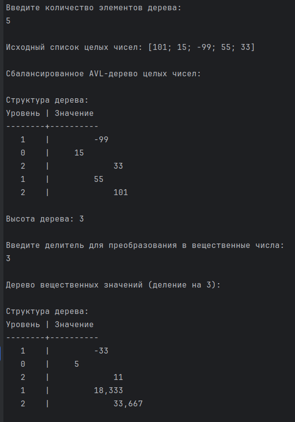
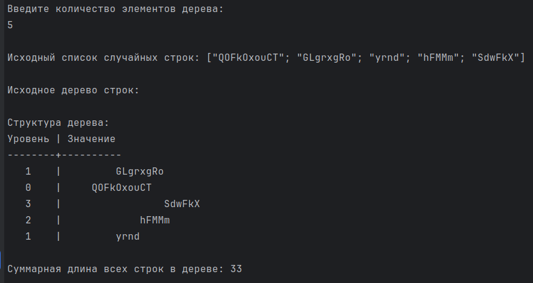

# Красных Александр ИТС-2 Лабораторная №3

# Задание 1

### Текст задачи

Дерево содержит целые числа. Получить дерево из вещественных значений,
разделив каждый элемент исходного на заданное число.

### Алгоритм решения

1. Для начала необходимо создать саму структуру нашего дерева и его отображения.
Для этого я возьму пример который давали нам на лекции и слегка его видоизменю
2. Структура бинарного дерева стандартная - слева меньшие значения справа большие,
что мы и имеем теперь в коде

### Тестирование

# Задание 2

### Текст задачи

Решить задачу из лабораторной работы №2 (Задание 2. List.fold) для
последовательности

### Алгоритм решения

1. Алгоритм здесь точно такой же как в прошлом задании. Берем основу ввиде кода с нашей прошлой работы и ищем,
что здесь нам пригодится.
2. Переписываем оставшееся для работы с последовательностью все также используя ленивые вычисления для
корректных результатов.
3. Переписываем основную программу под наши новые запросы.
4. Тестируем готовый код.

### Тестирование

